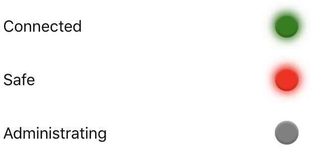
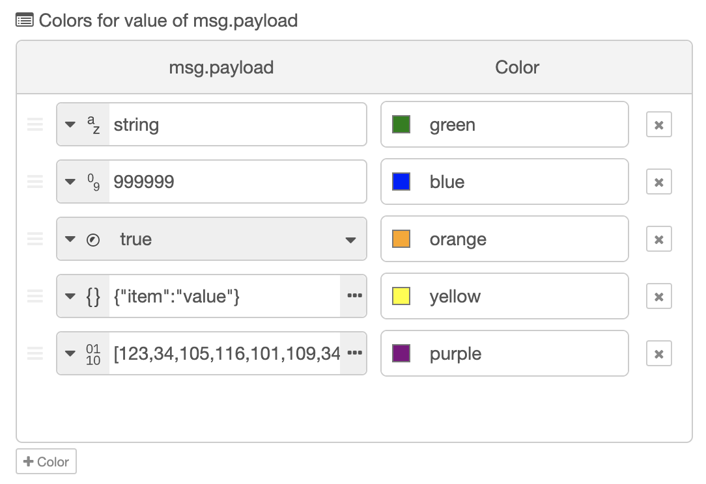

## Node-RED UI LED
A simple LED status indicator for the Node-RED Dashboard

[](https://github.com/Adorkable/node-red-contrib-ui-led/network/dependencies)
[](https://github.com/Adorkable/node-red-contrib-ui-led/network/dependencies)
[](https://github.com/Adorkable/node-red-contrib-ui-led/network/dependencies)
[](https://github.com/Adorkable/node-red-contrib-ui-led/network/dependencies)



The node uses `msg.payload`'s value to determine status. By default:

* `msg.payload` === `true` - **Green**
* `msg.payload` === `false` - **Red**
* no `msg` received yet or `msg.payload` !== `true` and `msg.payload` !== `false` - **Gray**

## Install
To install the node run the following from your Node-RED user directory (`~/.node-red`):
```bash
npm install node-red-contrib-ui-led
```

Or install the node from the Palette section of your Node-RED editor by searching by name (`node-red-contrib-ui-led`).

## Custom Statuses

Although `true` => Green and `false` => Red is the default, one can map other payload values to any color.

To customize the mappings open the node's configuration panel and scroll to the _Colors for Values_ list.



To add a value mapping press the **+Color** button at the bottom of the list. 

Next fill in a color in a [CSS](https://developer.mozilla.org/en-US/docs/Web/CSS/color_value) format (color name, hex, rgb, rgba...), select the value type (`string`, `boolean`...) and fill in an appropriate value.

Similarly existing Value => Color maps can be modified.

Finally to delete a mapping simply press the X button on the far right!

## Custom Statuses in `msg`

By enabling _Allow Color For Value map in msg_ in a node that node will use dictionaries passed via `msg.colorForValue` to override any previous color to value mappings. 

The format should be `value` => `color`, ie an object whose key values return color values.

Example:

```js
msg.colorForValue = {};
msg.colorForValue[true] = "purple";
msg.colorForValue[false] = "orange";
```

### Further Examples

To see usages already set up check out the examples included with the project by using _Import_ in your Node-RED editor!
